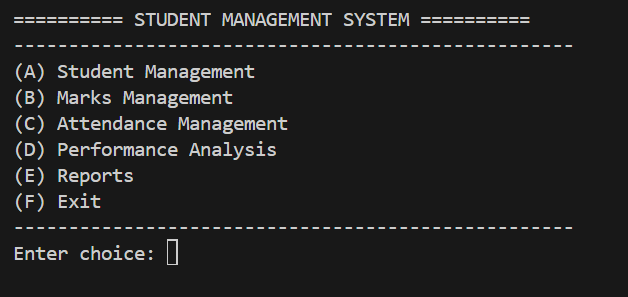
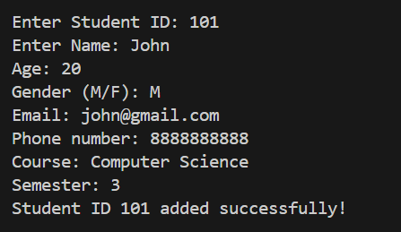
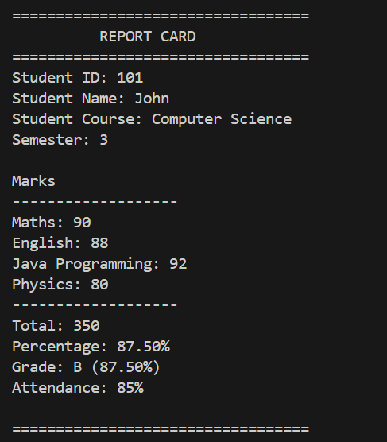

# Student Management System (Python)

A menu-driven Student Management System built using Python.

This application allows users to manage student records, marks, attendance, generate report cards, and analyze student performance. Student data is stored permanently using JSON, making the system reusable across multiple sessions.

## Project Overview

The Student Management System is a console-based Python application that helps manage student records in a structured way. It provides features for student information, marks, attendance, performance analysis, and report generation while storing data permanently using JSON.

The application includes **19 core functions** organized into five modules:
## Features

### Student Management
- Add Student
- Delete Student
- Update Student
- Search Student
- Display All Students

### Marks Management
- Add Marks
- Update Marks
- Calculate Average
- Calculate Percentage
- Calculate Grade

### Attendance Management
- Add Attendance
- Update Attendance
- Attendance Warning

### Performance Analysis
- Rank Students
- Find Topper
- Find Lowest Scorer
- Average Class Percentage
- Scholarship Eligibility

### Reports
- Generate Student Report Card

## Screenshots

### Main Menu



### Student Management



### Report Card



## Technologies Used

- Python 3
- JSON
- Git
- GitHub
- VS code

## Project Structure

```
Student Management System/
│
├── functions/
│   ├── student.py
│   ├── marks.py
│   ├── attendance.py
│   ├── analysis.py
│   └── report.py
│
├── images/
│   ├── add-student.png
│   ├── main-menu.png
│   └── report-card.png
│
├── main_file.py
├── student_info.json
├── README.md
```

## How to Run

1. Clone the repository

```bash
git clone https://github.com/anshikadeo63/student-management-system-python.git
```

2. Navigate to the project folder

```bash
cd student-management-system-python
```

3. Run the program

```bash
python main_file.py
```
## Sample Menu

```
========== STUDENT MANAGEMENT SYSTEM ==========
---------------------------------------------------
(A) Student Management
(B) Marks Management
(C) Attendance Management
(D) Performance Analysis
(E) Reports
(F) Exit
---------------------------------------------------
```
## Skills Demonstrated

- Python Programming
- Modular Programming
- Functions
- Dictionaries & Nested Dictionaries
- Loops and Conditional Statements
- Exception Handling
- File Handling
- JSON Data Persistence
- Menu-Driven Application Design
- Git & GitHub Version Control

## Future Improvements

- CSV Export
- SQLite Database Integration
- Graphical User Interface (Tkinter)
- User Authentication System
- Advanced Search & Filtering

## Author

**Anshika Deo**

Computer Science Student | University of Central Florida 

GitHub: [anshikadeo63](https://github.com/anshikadeo63)

## License

This project is for educational and portfolio purposes.